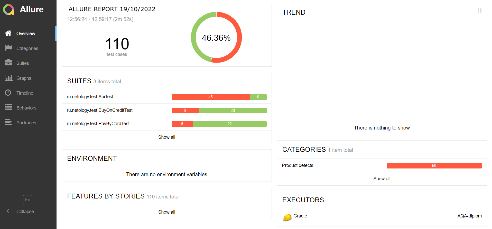

# Отчет о тестировании веб-сервиса для приобретения путевок

## Краткое описание

17.10.22 - 19.10.22 было проведено автоматизированное тестирование веб-сервиса для приобретения путевок с онлайн-оплатой или оплатой в кредит.

В ходе проверки были проведены тесты UI, тестирование записи в БД, тестирование API.

## Описание процесса тестирования

После получения SUT было проведено исследовательское тестирование с использованием техник эквивалентного разделения и граничных значений.  
В ходе этого этапа было протестирована сама форма ввода, БД, а также API.

Перед началом автоматизации был разработан [план автоматизации](Plan.MD).

### Тестовые данные:

В качестве тестовых данных использовались данные, предоставленные разработчиком (номера и статусы карт), для остальных данных использовалась автоматическая генерация.

### Тестирование производилось в следующем окружении:

Windows 10 Домашняя для одного языка версия 21H1  
Версия Java 11.0.11

### Тестирование:

Всего было проведено 110 тестов, из них 59 тестов закончились неуспешно, что составляет 53,6% от общего количества.
В основном неуспешно закончились API тесты: 45 из 54, или 83,3%.

По итогам сформирован отчет с использованием Allure Report.

Выявленные дефекты были отражены в Issue.

### Общие рекомендации:
1.	Устранить обнаруженные дефекты
2. Добавить CSS селекторы для тестирования
3. Разработать документацию на БД.
4. Установить валидацию полей при передаче данных в БД.